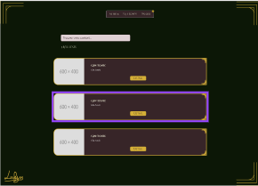
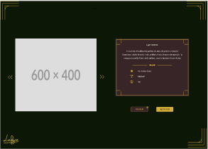
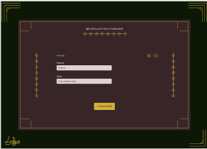
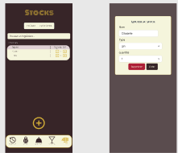

# Lukyss Bar

Il s'agit d'un projet comprenant un site web, une Api et une application mobile.   
Le bu de ce projet est de permettre à un administrateur d'afficher les cocktails qu'ils peut réaliser pour ses convives en fonction de son stock d'ingrédients.   
Les utilisateur prennent des commandes sur l'application web, l'administrateur les reçoit sur une application mobile et peut ainsi gérer les commandes.   
Ce Monorepo a été créé avec [TurboRepo](https://turborepo.com/).

## Maquettes

### Site Web






### Application Mobile




## Apps and Packages

- `web`: une app [Next.js](https://nextjs.org/)
- `api`: une api [NestJs](https://nestjs.com/) app
- `mobile`: une app [React Native](https://reactnative.dev/) et [Expo](https://expo.dev/)
- `@lukyss-bar/eslint-config`: `eslint` configurations (inclu `eslint-config-next` et `eslint-config-prettier`)
- `@lukyss-bar/typescript-config`: `tsconfig.json`utilisée dans le monorepo
- Drizzle
- Postgres

Chaque package/app est 100% [TypeScript](https://www.typescriptlang.org/).

## Utilities

- [TypeScript](https://www.typescriptlang.org/)
- [ESLint](https://eslint.org/) pour le linting du code
- [Prettier](https://prettier.io) pour le formattage du code

## Seed Data

up le container postgres

```
npm -w @lukyss-bar/api run db:generate
npm -w @lukyss-bar/api run db:migrate
npm -w @lukyss-bar/api run db:seed
```

## API

### impératifs nest cours


- Utiliser Nest, Nestia, Temps réel, SDK FrontEnd Nestia
- Utiliser une abstraction supplémentaire pour nest -> les répository
- utiliser la clean archi
- neverthrow pour Monade ResultAsync
- Mono repo sur LukyssBar

### fonctionnalités

- liste des cocktails - ok
- cocktails par id - ok
- créer un cocktail si users admin - ok
- générer des codes promo si user admin - ok
- modifier un coktail si user admin (image, nom, prix) - ok
- save image dans /upload - ok
- crud ingredient si user admin - ok
- ajouter/modifier/supprimer des ingrédients a un cocktail si user admin - ok
- gérer le stock si admin - ok
	- passer un ingrédient de false a true et inversement - ok
- creer et lire une commande - user
- voir les commandes si user admin
- faire une commande si user normal + code promo pour valdier commande
	-> retourne liste cocktails, code promo utilisé, puis objet commande avec statut et prix total
- Ajouter Nestia et sdk front
- Neverthrow
- temps reel pour suivi de commande (commande en attente d'acceptation, acceptee, en preparation, prete)

### packages

- pg pour accès db postgres
- passport pour authentification
- bcrypt pour hashage de mot de passe


<!--### Build

To build all apps and packages, run the following command:

```
cd my-turborepo

# With [global `turbo`](https://turborepo.com/docs/getting-started/installation#global-installation) installed (recommended)
turbo build

# Without [global `turbo`](https://turborepo.com/docs/getting-started/installation#global-installation), use your package manager
npx turbo build
yarn dlx turbo build
pnpm exec turbo build
```

You can build a specific package by using a [filter](https://turborepo.com/docs/crafting-your-repository/running-tasks#using-filters):

```
# With [global `turbo`](https://turborepo.com/docs/getting-started/installation#global-installation) installed (recommended)
turbo build --filter=docs

# Without [global `turbo`](https://turborepo.com/docs/getting-started/installation#global-installation), use your package manager
npx turbo build --filter=docs
yarn exec turbo build --filter=docs
pnpm exec turbo build --filter=docs
```

### Develop

To develop all apps and packages, run the following command:

```
cd my-turborepo

# With [global `turbo`](https://turborepo.com/docs/getting-started/installation#global-installation) installed (recommended)
turbo dev

# Without [global `turbo`](https://turborepo.com/docs/getting-started/installation#global-installation), use your package manager
npx turbo dev
yarn exec turbo dev
pnpm exec turbo dev
```

You can develop a specific package by using a [filter](https://turborepo.com/docs/crafting-your-repository/running-tasks#using-filters):

```
# With [global `turbo`](https://turborepo.com/docs/getting-started/installation#global-installation) installed (recommended)
turbo dev --filter=web

# Without [global `turbo`](https://turborepo.com/docs/getting-started/installation#global-installation), use your package manager
npx turbo dev --filter=web
yarn exec turbo dev --filter=web
pnpm exec turbo dev --filter=web
```-->

<!--### Remote Caching

> [!TIP]
> Vercel Remote Cache is free for all plans. Get started today at [vercel.com](https://vercel.com/signup?/signup?utm_source=remote-cache-sdk&utm_campaign=free_remote_cache).

Turborepo can use a technique known as [Remote Caching](https://turborepo.com/docs/core-concepts/remote-caching) to share cache artifacts across machines, enabling you to share build caches with your team and CI/CD pipelines.

By default, Turborepo will cache locally. To enable Remote Caching you will need an account with Vercel. If you don't have an account you can [create one](https://vercel.com/signup?utm_source=turborepo-examples), then enter the following commands:

```
cd my-turborepo

# With [global `turbo`](https://turborepo.com/docs/getting-started/installation#global-installation) installed (recommended)
turbo login

# Without [global `turbo`](https://turborepo.com/docs/getting-started/installation#global-installation), use your package manager
npx turbo login
yarn exec turbo login
pnpm exec turbo login
```

This will authenticate the Turborepo CLI with your [Vercel account](https://vercel.com/docs/concepts/personal-accounts/overview).

Next, you can link your Turborepo to your Remote Cache by running the following command from the root of your Turborepo:

```
# With [global `turbo`](https://turborepo.com/docs/getting-started/installation#global-installation) installed (recommended)
turbo link

# Without [global `turbo`](https://turborepo.com/docs/getting-started/installation#global-installation), use your package manager
npx turbo link
yarn exec turbo link
pnpm exec turbo link
```

## Useful Links

Learn more about the power of Turborepo:

- [Tasks](https://turborepo.com/docs/crafting-your-repository/running-tasks)
- [Caching](https://turborepo.com/docs/crafting-your-repository/caching)
- [Remote Caching](https://turborepo.com/docs/core-concepts/remote-caching)
- [Filtering](https://turborepo.com/docs/crafting-your-repository/running-tasks#using-filters)
- [Configuration Options](https://turborepo.com/docs/reference/configuration)
- [CLI Usage](https://turborepo.com/docs/reference/command-line-reference)-->
